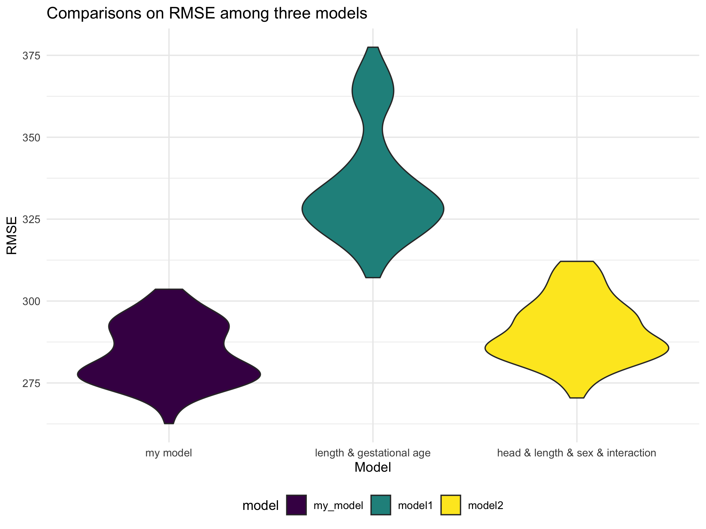

p8105\_hw6\_hw2849
================
Haotian Wu
11/30/2021

## Problem 1

##### Load and Clean Data

``` r
birthweight = read_csv("./birthweight.csv") %>% 
  janitor::clean_names() %>% 
  drop_na() %>%
  mutate( ## recode factor variables
    babysex = recode_factor(babysex, "1" = "male", "2" = "female"),
    frace = recode_factor(frace, "1" = "White", "2" = "Black", "3" = "Asian", "4" = "Puerto Rican", "8" = "Other"),
    mrace = recode_factor(mrace, "1" = "White", "2" = "Black", "3" = "Asian", "4" = "Puerto Rican"),
    malform = recode_factor(malform, "0" = "absent", "1" = "present" )
    ) %>%
  print()
```

    ## Rows: 4342 Columns: 20

    ## ── Column specification ────────────────────────────────────────────────────────
    ## Delimiter: ","
    ## dbl (20): babysex, bhead, blength, bwt, delwt, fincome, frace, gaweeks, malf...

    ## 
    ## ℹ Use `spec()` to retrieve the full column specification for this data.
    ## ℹ Specify the column types or set `show_col_types = FALSE` to quiet this message.

    ## # A tibble: 4,342 × 20
    ##    babysex bhead blength   bwt delwt fincome frace gaweeks malform menarche
    ##    <fct>   <dbl>   <dbl> <dbl> <dbl>   <dbl> <fct>   <dbl> <fct>      <dbl>
    ##  1 female     34      51  3629   177      35 White    39.9 absent        13
    ##  2 male       34      48  3062   156      65 Black    25.9 absent        14
    ##  3 female     36      50  3345   148      85 White    39.9 absent        12
    ##  4 male       34      52  3062   157      55 White    40   absent        14
    ##  5 female     34      52  3374   156       5 White    41.6 absent        13
    ##  6 male       33      52  3374   129      55 White    40.7 absent        12
    ##  7 female     33      46  2523   126      96 Black    40.3 absent        14
    ##  8 female     33      49  2778   140       5 White    37.4 absent        12
    ##  9 male       36      52  3515   146      85 White    40.3 absent        11
    ## 10 male       33      50  3459   169      75 Black    40.7 absent        12
    ## # … with 4,332 more rows, and 10 more variables: mheight <dbl>, momage <dbl>,
    ## #   mrace <fct>, parity <dbl>, pnumlbw <dbl>, pnumsga <dbl>, ppbmi <dbl>,
    ## #   ppwt <dbl>, smoken <dbl>, wtgain <dbl>

We converted variables into correct types. For example, `babysex`,
`frace`, `mrace`, and `malform` were present in numeric, and after
tidying, these variables are recoded into factor. Missing data are
dropped. After tidy, there are 4342 observations with 20 variables
included in the data set.

##### Regression Models

Evidences have shown social and environmental behaviors of parents are
associated with infant birth weight. We hypothesized family incomes,
pre-pregnancy weight and BMI, mothers’ weight change during pregnancy,
and smoking behavior would be factors that affect infant birth weight.
In addition, we look at baby’s birth length and head circumference which
would be related to baby weight. Thus, building a model with predictors
of `bhead`, `blength`, `fincome`, `ppbmi`, `ppwt`, `smoken`, and
`wtgain`, to see the associations of these variables with `bwt`.

``` r
my_model = lm(bwt ~  bhead + blength + fincome + ppbmi + ppwt + smoken + wtgain, data = birthweight) ## regression model 

my_model %>% ## tidy the regression model
  broom::tidy() %>% 
  select(term, estimate, p.value) %>% 
  knitr::kable(digits = 3)
```

| term        |  estimate | p.value |
|:------------|----------:|--------:|
| (Intercept) | -5859.137 |       0 |
| bhead       |   139.247 |       0 |
| blength     |    80.483 |       0 |
| fincome     |     1.317 |       0 |
| ppbmi       |   -11.329 |       0 |
| ppwt        |     3.150 |       0 |
| smoken      |    -2.468 |       0 |
| wtgain      |     4.129 |       0 |

Add fitted values to the model, and plot the model residuals.

``` r
resid_pred_model = birthweight %>%  ## add residuals and predicted values
  add_residuals(my_model) %>% 
  add_predictions(my_model)

resid_pred_model %>% 
  ggplot(aes(x = pred, y = resid, color = resid)) + 
  geom_point(alpha = .5) + 
  labs(
    title = "Residuals vs fitted values",
    x = "Predicted values",
    y = "Residuals"
  )
```


##### Comparison

Now, compare my model to two others.

``` r
## comparisons between models: cross validation
cv_df = 
  crossv_mc(birthweight, 100) %>% 
  mutate(
    train = map(train, as_tibble),
    test = map(test, as_tibble)
  )

cv_df = cv_df %>% 
  mutate(
    my_model  = map(train, ~lm(bwt ~  bhead + blength + fincome + ppbmi + ppwt + smoken + wtgain, data = .x)),
    model1  = map(train, ~lm(bwt ~ blength + gaweeks, data = .x)), ## length at birth and gestational age as predictors
    model2  = map(train, ~lm(bwt ~ bhead + blength + babysex + bhead * blength + bhead * babysex + blength * bhead + bhead * blength * babysex, data = .x))  ## head circumference, length, sex, and all interactions between these
  ) %>% 
  mutate(
    rmse_my_model = map2_dbl(my_model, test, ~rmse(model = .x, data = .y)),
    rmse_model1 = map2_dbl(model1, test, ~rmse(model = .x, data = .y)),
    rmse_model2 = map2_dbl(model2, test, ~rmse(model = .x, data = .y))
  )

## visualization the comparisons of models
cv_df %>% 
  select(starts_with("rmse")) %>% 
  pivot_longer(
    everything(),
    names_to = "model", 
    values_to = "rmse",
    names_prefix = "rmse_") %>% 
  mutate(model = fct_inorder(model)) %>% 
  ggplot(aes(x = model, y = rmse, fill = model)) + 
  geom_violin() + 
  labs(
    title = "Comparisons on RMSE among three models",
    x = "Model",
    y = "RMSE") + 
  scale_x_discrete(
    labels = c("my model", "length & gestational age", "head & length & sex & interaction"))
```



Comparing three models, we found that the model that we created
`bwt ~  bhead + blength + fincome + ppbmi + ppwt + smoken + wtgain` most
accurately predicted the baby birthweight.

## Problem 2

2017 Central Park weather data.

``` r
weather_df = 
  rnoaa::meteo_pull_monitors(
    c("USW00094728"),
    var = c("PRCP", "TMIN", "TMAX"), 
    date_min = "2017-01-01",
    date_max = "2017-12-31") %>%
  mutate(
    name = recode(id, USW00094728 = "CentralPark_NY"),
    tmin = tmin / 10,
    tmax = tmax / 10) %>%
  select(name, id, everything())
```

    ## Registered S3 method overwritten by 'hoardr':
    ##   method           from
    ##   print.cache_info httr

    ## using cached file: ~/Library/Caches/R/noaa_ghcnd/USW00094728.dly

    ## date created (size, mb): 2021-10-05 10:31:24 (7.602)

    ## file min/max dates: 1869-01-01 / 2021-10-31

##### Some bootstrapping

``` r
## estimate r square

r_square = weather_df %>% 
  bootstrap(n = 5000) %>% 
  mutate(
    models = map(strap, ~lm(tmax ~ tmin, data = .x)),
    results = map(models, broom::glance)
  ) %>% 
  select(-strap, -models) %>% 
  unnest(results) %>% 
  select(r.squared)

## plot the distribution for r square

r_square_plot = r_square %>% 
  ggplot(aes(x = r.squared, fill = r.squared)) + 
  geom_density() + 
  labs(
    title = "Distribution of Estimate of r square",
    x = "r square"
  )
```

``` r
## estimate log beta_0 * beta_1

beta_estimate = weather_df %>% 
  modelr::bootstrap(n = 5000) %>% 
  mutate(
    models = map(strap, ~lm(tmax ~ tmin, data = .x)),
    results = map(models, broom::tidy)) %>% 
  select(-strap, -models) %>% 
  unnest(results) %>% 
  select(term, estimate) %>% 
  mutate(
    term = recode(term, "(Intercept)" = "intercept")
  ) %>% 
  pivot_wider(
    names_from = "term",
    values_from = "estimate") %>% 
  unnest() %>% 
  mutate(
    log_beta = log(intercept * tmin)
  )

## plot the distribution for log beta

beta_plot = beta_estimate %>% 
  ggplot(aes(x = log_beta, fill = log_beta)) + 
  geom_density() + 
  labs(
    title = "Distribution of Estimate of log beta",
    x = "log(beta_0 * beta_1)"
  )

r_square_plot + beta_plot
```


With 5000 bootstrap samples for each estimate, we observed that the
distribution of r square tends to be slightly left-skewed, and log(beta0
\* beta1) is approximately normal.

##### 95% confidence interval

``` r
## calculate the CI of r_square
quantile(r_square$r.squared, c(0.025, 0.975)) 
```

    ##      2.5%     97.5% 
    ## 0.8933706 0.9273907

``` r
## calculate the CI of log(beta0*beta1)
quantile(beta_estimate$log_beta, c(0.025, 0.975))
```

    ##     2.5%    97.5% 
    ## 1.965833 2.057778

The 95% confident interval of *r̂*<sup>2</sup> is (0.8937, 0.9274).

The 95% confident of *l**o**g*(*β̂*<sub>0</sub> \* *β̂*<sub>1</sub>) is
(1.9645, 2.0596).
